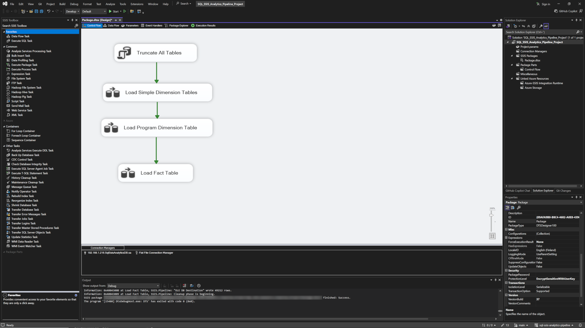
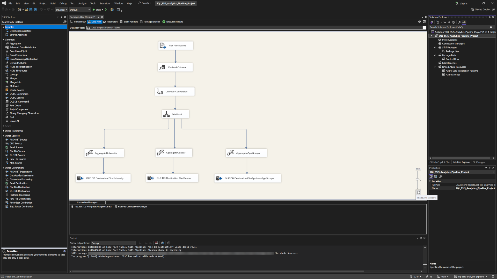
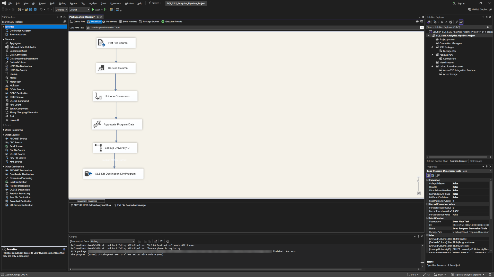
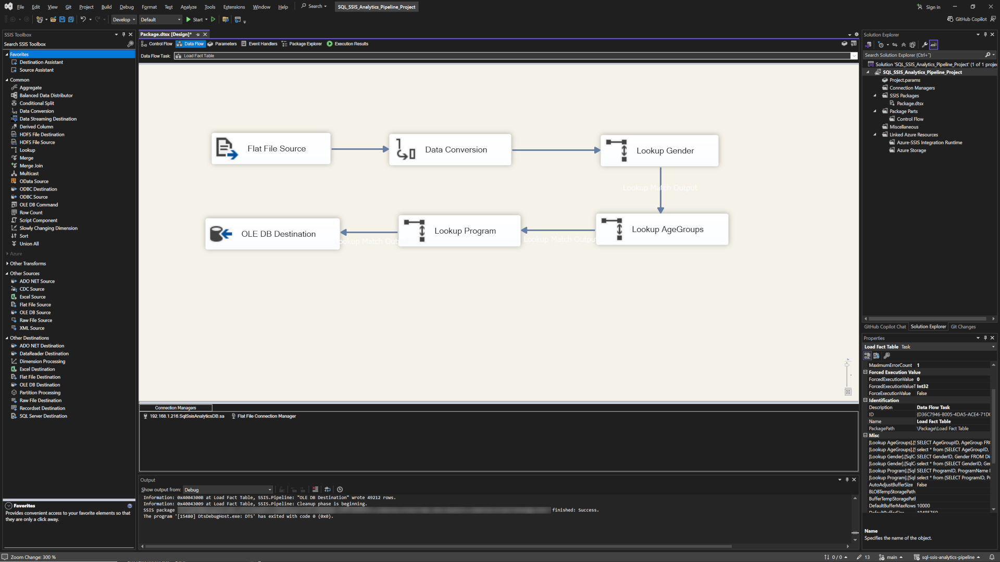
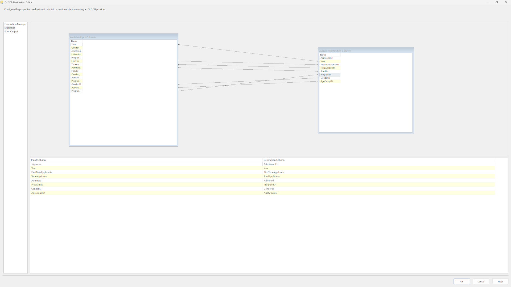

# ETL Process Walkthrough: SQL SSIS Analytics Pipeline

## Objective

The goal of this ETL (Extract, Transform, Load) process is to take the cleaned, consolidated CSV file (`all_admissions_clean.csv`) and load its data into the structured [Star Schema](https://en.wikipedia.org/wiki/Star_schema) within the SQL Server database.

This pipeline was built using **SQL Server Integration Services (SSIS)**, a standard enterprise tool for data integration, in Visual Studio. The design aims to follows professional best practices to ensure data integrity, robustness, and reusability.

## 1. Architecture: The Control Flow

The entire ETL process is managed by a single Control Flow, separating the loading of dimensions from the loading of the **fact table** (ensuring relational integrity).

The Control Flow executes four main tasks in sequence:

1.  **TRUNCATE All Tables:** A SQL Task that clears all data from the destination tables. This makes the entire package re-runnable for development and testing.
2.  **Load Simple Dimensions:** A Data Flow Task to populate the small, independent dimension tables (`DimUniversity`, `DimApplicantGender`, `DimApplicantAgeGroup`).
3.  **Load Program Dimension:** A separate Data Flow Task to populate the `DimProgram` table. This task runs *after* the simple dimensions are loaded so it can successfully look up the `UniversityID`.
4.  **Load Fact Table:** The final Data Flow Task, which loads the main `FactAdmissions` table by looking up the keys from all the newly populated dimension tables.

[]

## 2. The Data Flow Tasks

### Data Flow 1: Loading Simple Dimensions

This data flow loads the `DimUniversity`, `DimGender`, and `DimApplicantAgeGroup` tables in parallel to be as efficient as possible.

[]

The process is as follows:
1.  **Flat File Source:** Reads needed columns from the master file.
2.  **Derived Column:** A data cleansing step that applies the `TRIM()` function to all text columns. This was added to resolve data quality errors with trailing whitespaces.
3.  **Data Conversion** Conversion of data to Unicode and size to fit Database restrictions from `1_Database/schema.sql`.
3.  **Multicast:** Splits the single stream of clean data into three identical, parallel streams.
4.  **Aggregate:** Each stream goes to its own `Aggregate` transformation, which finds the unique values for a specific column (e.g., University, Gender, or AgeGroup).
5.  **OLE DB Destination:** Each set of unique values is loaded into its corresponding dimension table in the database.

### Data Flow 2: Loading the Program Dimension

This data flow populates the `DimProgram` table, which has a dependency on `DimUniversity`.

[]

The process is as follows:
1.  **Flat File Source:** Reads the source data again.
2.  **Aggregate:** Finds the unique combinations of `University`, `Faculty`, and `ProgramName`.
3.  **Lookup UniversityID:** Takes the `University` name from the data flow, finds the matching record in the `DimUniversity` table (populated in step 1), and returns its `UniversityID` foreign key.
4.  **OLE DB Destination:** Loads the `ProgramName`, `FacultyName`, and the `UniversityID` into the `DimProgram` table.

### Data Flow 3: Loading the Fact Table

Final data flow where the central `FactAdmissions` table is loaded.

[]

The process is a chain of data enrichment:
1.  **Flat File Source:** Reads all rows from the source file.
2.  **Lookup Chain:** The data flows through a series of **Lookup Transformations**. Each lookup takes a text value from the source data (e.g., `Gender`), finds its corresponding record in the appropriate dimension table, and adds its integer ID (`GenderID`) to the data stream. This is repeated for `AgeGroupID` and `ProgramID`.
3.  **OLE DB Destination:** The final, fully enriched data—containing all the numeric metrics and all the correct foreign key IDs—is loaded into the `FactAdmissions` table.

[]

## 3. Production Deployment and Scheduling

This SSIS package (`.dtsx` file) represents the complete, tested ETL logic. In a real-world production scenario, the next steps would be:

1.  **Deployment:** The project would be deployed to the **SSIS Catalog** on a production SQL Server instance.
2.  **Scheduling:** The package execution would be scheduled for nightly runs using a **SQL Server Agent Job**.

This ensures that the admissions data is automatically updated on a regular basis, providing fresh insights to the business without any further manual intervention.