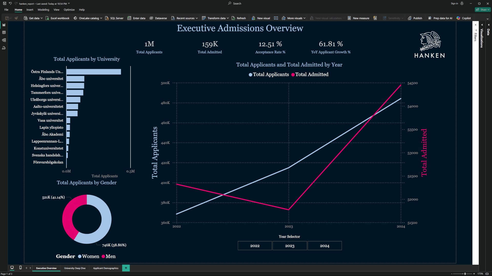

# SQL & SSIS Analytics Platform and Pipeline
This project was a personal deep-dive into building a full, end-to-end data pipeline from scratch. My goal was to tackle a genuinely messy, real-world data problem and see it through every stage: from sourcing ([Vipunen.fi](https://vipunen.fi/en-gb/)) and Python scripting, to database design and ETL with SSIS, all the way to a polished, interactive dashboard in Power BI.

## Objective

This project simulates a full data pipeline, including:
1.  **Data Sourcing & Transformation:** Engineering a robust Python script to automate the cleaning of messy, real-world data.
2.  **Database Management & ETL:** Designing and deploying a relational database on MS SQL Server and building an SSIS pipeline to populate it.
3.  **BI & Reporting:** Creating a dynamic, user-centric dashboard with Power BI to derive and present actionable insights.

## Project Status

**Completed.** All three project phases are finished. The final interactive dashboard is available for review at the bottom.

## Part 1: Data Sourcing & Automated Transformation

*This initial phase is a case study in solving a real-world data engineering problem: acquiring and cleaning messy, inconsistent data from a protected public source.*

### 1. The Business Problem: A Manual and Inefficient Process

The project began by sourcing admissions data from the Finnish education statistics portal, [Vipunen.fi](https://vipunen.fi/en-gb/). Initial investigation revealed a significant business challenge:

*   **No Raw Data Access:** Instead of providing raw data files, the portal utilizes a Single-Page Application (SPA) to embed a Microsoft Excel Online instance. This architecture, likely using Microsoft's WOPI protocol, is designed for interactive user reports, creating a significant barrier to automated data extraction.
*   **Manual, Repetitive Work Required:** The only way to acquire detailed data was to manually filter and download dozens of individual report files. To keep the project manageable (*and for my own sanity*), I chose a dataset of 3 years, broken down by gender and 16 separate age groups. Even with this scope, the process meant manually downloading and organizing over 100 individual .xlsb files before the real work could even begin.

### 2. The Data Transformation Challenge

Vipunens raw `.xlsb` files were formatted for visual reporting, not machine processing, and presented several technical challenges as they are Binary files rather than more common XML structured data found in `xlsx` files:

*   **Binary Format:** The data was in a binary `.xlsb` format, making it unreadable by standard text-based parsers.
*   **Hierarchical Structure:** The data used visual indentation to represent the relationship between Universities, Faculties, and Programs rather than seperate cells.
*   **Inconsistent Data Types:** Numbers were stored as text, included ranges (`1-4`), and were mixed with `None` or blank values.
*   **Report Formatting:** The files contained extra header rows, titles, and empty rows for spacing that needed to be programmatically ignored.

### 3. The Solution: An Automated Python Pipeline

To solve this, I wrote [1_Database/process_data.py](./1_Database/process_data.py). My goal was to create a script that could take the folder of messy files and, with one click, automate the entire cleaning process.

The script performs the following steps:
1.  **Loads a Master Institution List:** Reads the `institutions.txt` file to know all valid University and Faculty names in advance.
2.  **Directly Reads `.xlsb` Files:** Uses the `pyxlsb` library to parse the binary Excel format, avoiding the need for manual conversion to CSV.
3.  **Parses Metadata from Filenames:** Intelligently extracts the `Year`, `Gender`, and `AgeGroup` for each file based on the established naming convention.
4.  **Executes a State Machine:** Iterates through each report, using the master list to understand the current context.
5.  **Extracts Granular Data:** Saves only the most detailed, program-level rows, discarding the aggregated total rows to ensure data integrity.
6.  **Standardizes and Consolidates:** Cleans and converts all data to the correct types and combines the data from all ~50 source files into a single master CSV.

*The final version was the result of an iterative development and debugging process. Initial hypotheses based on visual cues (like indentation or comma counts) proved insufficient against the complex and inconsistent nature of the data. The definitive solution was to engineer a "state machine" parser that uses a master list of institutions (`institutions.txt`) as its source of truth. This allows the script to reliably distinguish between institutional context rows and granular data rows.*

### 4. The Result: An Analysis-Ready Data Asset

The outcome of this automated pipeline is a single, clean file: `processed_data/all_admissions_clean.csv`.

*   **Structure:** A flat, "tidy" table with over 60,000 rows of granular data.
*   **Columns:** `Year`, `Gender`, `AgeGroup`, `University`, `Faculty`, `ProgramName`, `FirstTimeApplicants`, `TotalApplicants`, `Admitted`.
*   **Value:** This clean, consolidated CSV file eliminates the initial data sourcing problem

### 5. Database Design

The final step of this phase was to design the database schema. I wanted a classic `Star Schema` (as a learning opportunity), but during development it naturally evolved into a `Snowflake Schema`, as it felt like a more robust design for the situation.

The `FactAdmissions` table connects to `DimProgram`, which in turn connects to `DimUniversity`. This Snowflake design offers superior data integrity and storage efficiency, ensuring that university or faculty details only need to be updated in a single location.

To also simulate a professional environment, `SQLCMD` variables were used to make DatabaseNames and file paths reusable and configurable.

## Part 2: ETL Pipeline with SSIS

The next phase was to build an ETL (Extract, Transform, Load) pipeline to populate the database. I chose to use **SQL Server Integration Services (SSIS)** to get hands-on experience with a traditional, enterprise-grade tool.

The complete SSIS solution can be found in the `2_ETL_SSIS/` directory and includes:

*   `SQL_SSIS_Analytics_Pipeline_Project.sln` - The Visual Studio solution file.
*   `Package.dtsx` - The SSIS package file containing all the ETL logic described below.

A step-by-step explanation of the ETL architecture, including screenshots of the Control Flow and Data Flows, is available in the [ETL Process Walkthrough](./2_ETL_SSIS/etl_walkthrough.md).

## Part 3: BI Reporting & Visualization (Next Steps)

The final phase of the project was to connect to the populated SQL database and build an interactive dashboard using **Microsoft Power BI**. The goal was not simply to display data, but to create an intuitive and insightful analytical application that allows users to explore the complex admissions landscape. The complete Power BI project file (`.pbix`) can be found in the `3_BI_Dashboard/` directory.

### 1. Advanced Analytics with DAX

To bring the dashboard to life, I leaned heavily on DAX measures rather than simple drag-and-drop columns. This gave me much more control and allowed for some neat features:

*   **Core KPIs:** `Total Applicants`, `Total Admitted`, and `Acceptance Rate %`.
*   **Time Intelligence:** `YoY Applicant Growth %` to track trends over time, using a dedicated `DimDate` table.
*   **Dynamic Ratios:** `Female Applicant Ratio %` and `Male Applicant Ratio %` to analyze demographic shifts.
*   **Advanced Normalization:** A `[% of University's Applicants by Age Group]` measure to enable the heatmap visual on the final report page, normalizing data and allowing for fair comparison between universities of different sizes.
*   **Dynamic Text:** A measure was built to generate dynamic page titles (e.g., "Deep Dive: University X") that respond to user selections.

### 2. User-Centric Design and Theming

I believe a good dashboard should be a pleasure to use, so I spent a lot of time on the design and user experience to make sure it felt polished and intuitive.

*   **Custom Theme:** To create a more immersive experience a specific University logo was sourced, while a JSON theme was crafted with specific colors (`#001522`, `#A5C5E9`, `#E3006F`) and very elegant font (`Georgia`). Perhaps you can guess which one? 
*   **Multi-Page Structure:** The report is structured into three logical pages (`Executive Overview`, `University Deep Dive`, `Applicant Demographics`), guiding the user from a high-level summary to detailed analysis.
*   **Data Integrity & Best Practices:** The data model was refined throughout the project, including cleaning dimension tables, replacing text-based keys with efficient numeric surrogate keys, and establishing a professional Snowflake Schema. Custom sort orders were implemented to ensure logical presentation of data (e.g., Age Groups).

### 3. Final Interactive Dashboard

The final result is a fully interactive multi-page report that allows for a comprehensive analysis of Finnish university admissions data. The Power BI report, [3_BI_Dashboard/admission_analytics_dashboard.pbix](./3_BI_Dashboard/admission_analytics_dashboard.pbix) is available in the repository.

*(Note: Public embedding is restricted on personal Power BI accounts. This GIF demonstrates the full interactivity of the report, from cross-filtering on the overview page to the dynamic titles and drill-down capabilities on the detail pages.)*